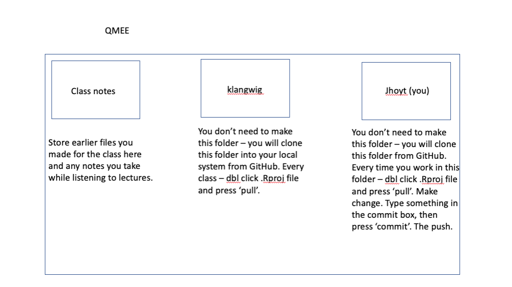

```{r setup, include=FALSE}
knitr::opts_chunk$set(echo = FALSE)
```

## Goals for today
- learn to link GitHub to RStudio
- edit your first project and send it to GitHub
- use the tidyverse to manipulate your data

# Pre-course homework

## Register for a GitHub username
- https://github.com/
- click on either of the big green sign up buttons

## Installing Git
 - Hopefully you have installed Git!
 - If not, please do so here, following the instructions:
 http://happygitwithr.com/install-git.html#install-git
 - Try to install git in the most scientific way possible - if one way doesn't work, try the next, and google your mistakes! 
 
## Install a Git client
- GitHub desktop is great for beginners
- https://desktop.github.com

## Enter your user name on Canvas on the assignments tab
- enter your github user name 

## How to organize your files for this class
```{r, out.width = "800px",echo=F}

```

 
## Tasks for today
- Configure Git on your computer
- Create a personal access token
- Set up a repository on GitHub
- clone that repository to your computer
- edit something in your repository
- commit your edits using Git
- Push your edits to GitHub
- Complete your assignment in tidyverse for week 2

## 1. Configure Git on your computer
- Open RStudio & click File-->New File --> RScript
- Type the following:
```{r, eval=FALSE, echo=TRUE}
## install if needed (only do this once)
## install.packages("usethis")
library(usethis)
use_git_config(user.name = "Jane Doe", "user.email = jane@vt.edu")
```
- Make sure you use the user name and email you used to sign up for github!  

## 2. Create a personal access token
- when we interact with Git, we need to tell it that we are a specific user that is allowed to make changes to the folder
- We have to create a token that we store on our computers to allow us access to connect to GitHub
- open this [link](https://github.com/VTQuantMethodsEEB/klangwig/blob/master/lectures/week_2_managing_data/git_token_help.R)
- copy and paste code and follow directions
```{r, eval=FALSE, echo=TRUE}
#abbreviated here:
usethis::create_github_token()
#Look over the scopes; I highly recommend selecting 
#“repo”, “user”, and “workflow”. 
#Click “Generate token”.
install.packages("gitcreds")
library(gitcreds)
gitcreds_set()
#paste your personal access token
gitcreds_get()
```


## 3. Set up a repository on GitHub
- navigate to https://github.com/VTQuantMethodsEEB 
- click the green New button to create a repository
  - If I haven't sent your Github user name, you won't be able to access this 
- type the name of your repository (I recommend lastname_project)
- choose 'Public' or 'Private'
- check the box to add a a README file
- click 'Create Repository'

## 4. Clone that repository to your computer
- In RStudio, click File-->New Project-->Version Control-->Git
- In Repository Name: Copy and paste the hyperlink from the browser of your repository
  - It will have a name like this: https://github.com/VTQuantMethodsEEB/WomenInDataScience
- In Project Directory: It should have the same name as the repo on GitHub (should autofill). It should be the name after the last /
- Create Project as subdirectory: Pick a smart place on your computer that you find without using a search function
- Click OK and you should clone into a new window that says 'YourRepo - main'

## 4 cont. Exploring your Repository
- this repository is the same as your GitHub repo that 'lives' on your local computer
- on the bottom right - Files tab, you should see your README and a file labeled REPO.Rproj
- this is a shortcut to your working directory and is how you can easily access and shortcut scripts using relative paths
- unlike Dropbox or google drive, GitHub doesn't automatically detect changes to your local folder. You need to tell it you are making a change using `commit`, and then send those changes using `push`.

## 5. Edit something in your repository
- Close the RStudio window and find the place where you stored the your GitHub repo
- add something to that folder (a script, an excel file) by copying and pasting
- double click the file that ends in the extension .Rproj to open your Git linked project
- Using the files tab, open the README file and type something there. This is the file that tells other users what is inside your project and what it does, but for now, you can add any text you want. Save the file when you are done (don't change the name)

## 6. Commit & Push your edits using Git
- at the top of your RStudio screen there is a sideways GIT button (it is gray, red, and green) next to AddIns
- click the dropdown and select 'Commit'
- on the left side, you'll see items with changes. It should be your README and the files you added. 
- check the boxes to stage the files and the Status should change to an M
- in the box on the right, type a commit message (this is mandatory)
- your message likely includes a very short description of what you did 'added file, README'
- press commit
- make sure you don't get any errors
- press the 'Push' button

## 7. Confirm that Push worked
- go to your Github repo online (e.g. https://github.com/VTQuantMethodsEEB/WomenInDataScience)
- ensure your files have updated to GitHub

## 8. Adding collaborators - me!
- henceforth, you will always add & edit files in this manner. You should not directly modify files using the browser
- If you want to collaborate with others, while on your GitHub repo, you will go to settings-->collaborator and teams--Add People
- *Important* you need to add me as a collaborator! (klangwig)
- can you can control what rights you give them

## Collaborating using GitHub
- if you have a collaborator on your project, they might make changes to something
- to avoid lots of merge conflicts, you should always 'pull' when you open your project
- this will make sure you are working on the most recent version
- if you and your collaborator are both working on the project and haven't branched (or are merging branches), you'll need to resolve merge issues
- this has to be done using the command line or the Desktop client (hence my recommendation for downloading)

## Going further
- Lots more to learn but you've accomplished the basics!
- Take a look at all the commands here:
https://happygitwithr.com/git-commands.html
- Play around with GitHub desktop to get a feel for what it does
- Venture into the shell and command line as you begin to explore more powerful GitHub tools

## Edit your README
- You should have a file called “README.md” in your project folder that was initialized when you made your repository.
- Open this document in Rstudio. At the top of the document, paste the paragraph about your data. 
- Below the paragraph about your data, start a log of what you did each week. 
- Each week, you will update this log by describing the type of investigations you might do with your data, and how you will break them up into different components (e.g. I will do xx analysis, and then I will make xx figure..), and you will always include: (1) what data file you used (2) what you called your R script. 
- See file https://github.com/VTQuantMethodsEEB/klangwig/blob/master/README_example.md.

## Sending your updated README to GitHUB
- As you did before, commit and push your changes to GitHub
- Similarly, navigate to your repo on GitHub via your web browser. Check to see if you can see your README file with your changes. If you can’t, (1) read through everything again and make sure you didn’t missing anything, (2) ask for help.

## Explore the tidyverse
- 1. Put your data in tidy format 
- 2. Read your data into R.
- 3. Examine your data for mistakes.
- 4. Experiment with “group by” in dplyr to do some calculation. 
- 5. Use mutate and summarise on your data. How are these different? Annotate your code.
- 6. Commit and push to GitHub. Be sure to update your README! 

## Turning in the assignment
When you have completed the assignment, please let me know by submitting a message through canvas assignments tab which is “DONE – github repo name”. (That way I won’t grade something that is incomplete and I can find your work). 


