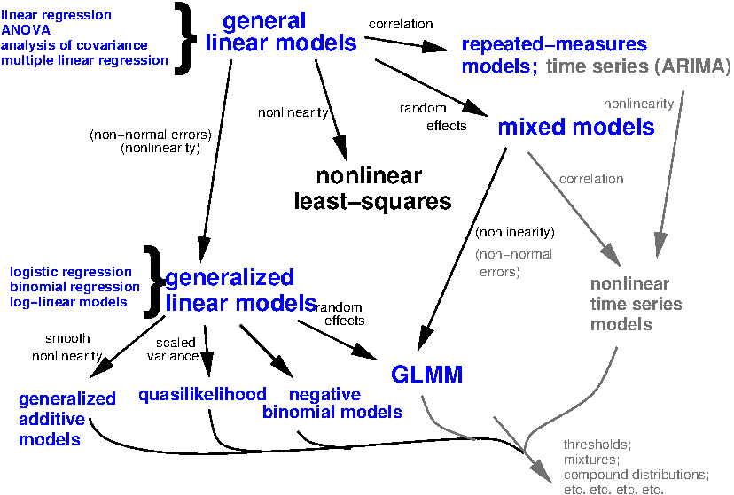

# Introduction
 
## History
 
- ANOVA, ANCOVA, regression, $t$ test are all variations of the same animal, the *general* linear model
- Many people (including the R project) call it a linear model (`lm`)
to distinguish it from the *generalized* linear model (`glm`)
- these models are typical fit by ordinary least squares

## (part of) the statistical universe



## Extended linear models
 
- *Generalized* linear models can incorporate:
    - (Some) non-linear relationships
    - Non-normal response *families* (binomial, Poisson, ...)
 - *Mixed* models incorporate *random effects*
    - Categories in data represent samples from a population
    - e.g. species, sites, genes ...
    - Traditionally used to account for experimental blocks
 
# Basic theory

## Assumptions
 
- *Response variables* are linear functions of *input variables*, in turn based on *predictor variables*
     - Can have one or more input variables per predictor variable
     - Each input variable is associated with an estimated parameter (more about this later)
- *Errors* or *residuals* are Normally distributed
     - In other words, the difference between our model *predictions*
       and our observations is Normal
     - *not* assuming the marginal distribution is Normal (e.g. a histogram of an input variable)
     - (Go to board/paper for residual drawing)
- Predictor variables are independent

## Machinery
 
-  *least squares* fit - we get parameters that minimize the squared differences between predictions and observations
- Least squares fits have a lot of nice properties
- Sensitive to some departures from the assumptions 
  - anomalous events tend to have a larger effect than they should

## One-parameter variables - continuous
 
- Continuous predictor variable: estimate a straight line with one parameter 
     - Also implies one *input variable*
- $Y = a+bX$
- $Y$ is the response  
- $X$ is the input variable   
- $b$ is the *slope* and the expected change in Y per unit change in X

## One-parameter variables - categorical
- Categorical predictor variable with two categories: only one parameter
     - difference in predicted value between levels
- Parameters are (usually) easy to interpret
  - Go to R example
 
## Multi-parameter variables
 
- With more than two categories, there is more than one
input variable (parameter) associated with a single predictor variable
- A note: Non-linear response to a predictor variable
    - Might be able to use a linear model! 
     - $Y = a + bX + cX^2$ is linear in $a$ and $b$ (the unknowns)

## Diagnostics
 
- Because the linear model is sensitive (sometimes!) to
assumptions, it is good to evaluate them
- Concerns:
    - *Heteroscedasticity* (does variance change across the
		data set, check diagnostic plots)
    - Linearity (does your model fit well?)
	- Normality (assuming no overall problems, do your
		**residuals** look Normal?)
		- What test would I use for this?
  - Independence (no autocorrelation)
    - current value is independent of the previous (historic) values - important for time series data
- Normality is the **least important** of these assumptions
 
## Default plots in R
```{r}
par(mfrow=c(2,2))  # set 2 rows and 2 column plot layout
mod_1 <- lm(mpg ~ disp, data=mtcars)  # linear model
plot(mod_1)
```

## Default plots in R - Heteroscedasticity 
- The plots on the left look at variance across the range of fitted values
-   They ask - as variable one increases, is it's explanatory ability similar across all values? These plots should be flat. Points should be randomly scattered.
```{r, echo=FALSE}
par(mfrow=c(2,2))  # set 2 rows and 2 column plot layout
mod_1 <- lm(mpg ~ disp, data=mtcars)  # linear model
plot(mod_1)
```

## Default plots in R - Normality of Residuals

- The plot on the top right examines normality of residuals - this line should be 1:1. It may be easier to examine with a shapiro-wilk test
```{r, echo=FALSE}
par(mfrow=c(2,2))  # set 2 rows and 2 column plot layout
mod_1 <- lm(mpg ~ disp, data=mtcars)  # linear model
plot(mod_1)
```


## Default plots in R - leverage of points

- The plot on the bottom right examines which points have the greatest influence on the regression. I do not recommend removing "real" outlier points but you should examine you results with and without them to see how much they influence your inference.
```{r, echo=FALSE}
par(mfrow=c(2,2))  # set 2 rows and 2 column plot layout
mod_1 <- lm(mpg ~ disp, data=mtcars)  # linear model
plot(mod_1)
```

## Diagnostic plots in code...

## Some other assumptions

- the number of datapoints is greater than the number of predictors
- there is some variability in the values of your predictor (e.g. x is not the same)
- your predictors aren't perfectly correlated (e.g. multicollinearity)
  - you can check this with corrplot 

## Correlation plots - which are correlated?
```{r,echo=FALSE,message=FALSE,warning=FALSE}
#Correlated pairs: (disp, cyl, hp, wt),
#gear, am
# hp, carb
library(corrplot)
corrplot(cor(mtcars[, -1]))
```

##Deciding what is "too"" correlated
- variance inflation factors give an estimate of the multicollinearity among variables
- they assess how much the variance of an estimated regression coefficient increases if your predictors are correlated
- > 4: investigate; >8-10 is cause for serious concern (sometimes ppl say even lower) 
- if no factors are correlated, the VIFs will all be 1
- any multicollinearity (even less than 8) can change regression coefs (try it!)
- removing variables is necessary, and will depend on data

## Resources
http://r-statistics.co/Assumptions-of-Linear-Regression.html
 - Go to R
 
## Transformations
 
- One way to deal with problems in model assumptions is by
	transforming one or more of your variables
- Transformations are not cheating: a transformed scale may be as
natural (or more natural) a way to think about your data as your
original scale
- The linear scale (no transformation) often has direct meaning, if
you are adding things up or scaling them (as in our ant example)
- The log scale is often the best scale for thinking about physical
quantities: 1:10 as 10:?
 
## Transformation tradeoffs
 
- A transformation may help you meet model assumptions
    - Homoscedasticity
    - Linearity
    - Normality
- But there is no guarantee that you can fix them all
- Piles of zeros are hard too (consider GLMs)
 
## Transformations to consider
 
- log-lin, lin-log and log-log for various sorts of exponential and
power relationships
- Box-Cox and Yeo-Johnson (takes negative values)
    - Note: *Box-Cox transformation* tries out transformations of the form
	$(y^\lambda-1)/\lambda$ ($\lambda=0$ corresponds to
	log-transformation)
- Avoid classical 'transform then linear model' recommendations for
     - probability data or count data
	 - Generally better to respect the structure of these data with a GLM
 
## Deciding whether to transform
 
- It's **not OK** to pick transformations based on trying different
ones and looking at P values
- It's probably OK to decide based on a measure of Normality of
residuals
 

 
# Tools for fitting and inference

## Basic tools

- `lm` fits a linear model
- `summary` prints statistics associated with the *parameters* that were fitted
- [see code]

## Multiple comparisons
 
- One standard of practice is to take a variable-level P value and
then evaluate patterns in the response to significant variables
- Straightforward, but maybe not conservative
- `TukeyHSD` does multiple comparison tests on objects
produced by `aov`.  Can also use `glht` in the `multcomp` package
more generally.
- Note: `aov` is just another way of calling `lm`, whereas
`anova` *compares* different model fits.  
- [see code]
 
## Plotting

- `plot` can be applied to an `lm` object to give you a nice set of diagnostic tests.
- `predict` can give predicted values, and standard errors.
- In `ggplot`, `geom_smooth(method="lm")` fits a linear model
	to each group of data (i.e.  each group that you have identified by
	plotting it in a different colour, within a different facet, etc.
	- [see code]


## Assignment

- Make a univariate linear model for one of your hypotheses
- Examine the assumptions of linearity (using tests and diagnostic plots)
- Explain what these are telling you (it's okay if they aren't normal, but tell me why)
- Plot the relationship in ggplot using stat_smooth or stat_summary
- You can hold off on submitting this assignment (which will be done via github) until after next weeks assignment
- Remember to update your README file - we will combine this week and next week so you can indicate that in your file